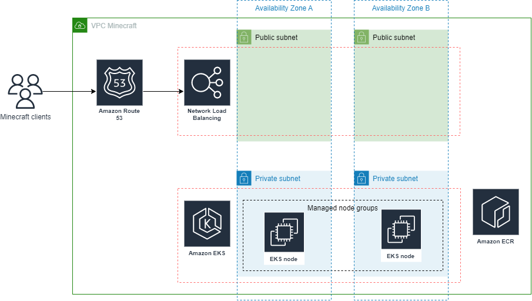

# Run Minecraft server inside EKS cluster

In this task we will create highly available and secure Minecraft server on Kubernetes in Amazon Web Services.

We will use [MultiPaper project](https://github.com/MultiPaper/MultiPaper) for this approach.
You can do this task following the step-by-step instructions or you can provision infrastructure on your own using this solution explanation as the requirements and then refer to instructions for self check.

# Problem statement
Application solution requires highly-available setup using AWS EKS as a platform.

# Content
  * [Solution approach](#solution)
  * [Reference Infrastructure Diagram](#diagram)
  * [Pre-requirements](#prereq)
  * [Minimum observability requirements](#requir)
  * [Hands-on labs](#handson)

# Solutioning approach 
- Use Managed node group for EKS
- Host EKS nodes in 2 availability zones
- Run all runtime in a private subnets.
- Use strict security rules for enabling communication between all components of the entire stack
- Use IAM role for controlled access for EKS cluster components
- Use Tags to mark all resources, e.g. 'Project'='EKS-Minecraft'
- Enable NLB as a single application entrypoint

# Reference AWS Infrastructure Diagram 

# Pre-requirements 
- Activated AWS account
- Basic knowledge in Kubernetes

# Minimum observability requirements 
- Avg CPU Utilization for worker nodes
- EKS pods CPU Utilization
- EKS Running pods count
- All metrics should be arranged into CloudWatch Dashboard

# Hands-on labs 
1. [Build runtime image and upload it to ECR](./task1_build_image.md)
2. [Provission cluster underlying infrastructure](./task2_provission_infra.md)
3. [Configure EKS cluster](./task3_configure_cluster.md)
4. [Create application deployment](./task4_create_app_deployment.md)
5. [Testing Minecraft server](./task5_testing_minecraft_server.md)
6. [Configure monitoring](./task6_configure_monitoring.md)
7. [Testing service HA](./task7_testing_service_ha.md)
