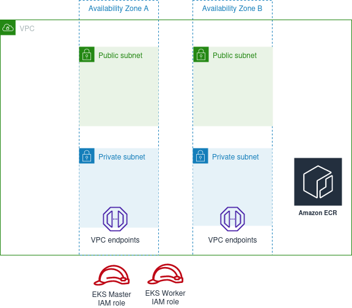

# Provission cluster underlying infrastructure

## Agenda

In this lab we will create the minimum required underlying infrastructure for running EKS cluster.

To achieve this we will need to create some AWS resources:
- Virtual Private Network with 2 Public subnets and 2 Private subnets in different Availability Zones
- IAM roles for EKS cluster 
- Required security groups
- SSH key (Optional)
- Create VPC endpoints

**Note:** Don't forget to tag all your resources to be able to find and delete them after the lab.

## Create Network stack
As best practice AWS recommends run EKS workers in private subnets(subnets without routes to internet gateway). But nodes need to connect to EKS endpoint, download service images from AWS ECR repositories and so on.
To get over it we will create VPC endpoints(AWS PrivateLink).

Create network stack for your infrastructure with the following resources:

- VPC: 
  - `name`=`minecraft-vpc`, `cidr`=`10.10.0.0/16`, `enable_dns_support=true`, `enable_dns_hostnames=true`
- 2 x Public subnets:
  - `name`=`public-a`, `cidr`=`10.10.1.0/24`, `az=a`
  - `name`=`public-b`, `cidr`=`10.10.2.0/24`, `az=b`
  - subnets must be tagged as described in this [document](https://aws.amazon.com/premiumsupport/knowledge-center/eks-vpc-subnet-discovery/). This will let EKS to deploy resources in appropriate subnets.
- 2 x Private subnets:
  - `name`=`private-a`, `cidr`=`10.10.11.0/24`, `az=a`
  - `name`=`private-b`, `cidr`=`10.10.12.0/24`, `az=b`
  - Subnets must be tagged as described in this [document](https://aws.amazon.com/premiumsupport/knowledge-center/eks-vpc-subnet-discovery/). This will let EKS to deploy resources in appropriate subnets.
- Internet gateway (`name`=`minecraft-igw`) and attach it to appropriate VPC
- Routing tables to bind Internet gateway with the Public subnets (`name`=`public-rt`)
- Routing tables to bind NAT gateway with the Private subnets (`name`=`private-rt`)

## Create security groups
Read [basic considerations](https://docs.aws.amazon.com/eks/latest/userguide/sec-group-reqs.html) regarding security groups in EKS.  
Create 3 security groups:
- `name`=`eks_master`, description="Communication with the cluster API Server":
  - ingress rule_1: `port`=`443`, `source`={eks_worker security group}, `protocol`=`tcp`
  - egress rule_1: allows any destination
- `name`=`eks_worker`, description="Access to worker nodes in the cluster":
  - ingress rule_1: `port`=any, `source_security_group`={eks_worker security group}, `description`="node to communicate with each other", `protocol=any`
  - ingress rule_2: `port`=any, `source_security_group`={eks_master security group}, `description`="master to communicate with each worker node", `protocol=any`
  - ingress rule_3: `port`=1025-65535, `source`={VPC CIDR}, description="incoming VPC traffic connections", protocol=tcp
  - egress rule_1: allows any destination
- `name`=`vpc_endpoints`, description="Defines access to vpc endopint":
  - ingress rule_1: `port`=443, `source`={VPC CIDR}, `description`="Allows access to vpc endpoint from any vpc ip", `protocol=tcp`
  - egress rule_1: allows any destination

**Note:** You will need to create another security group in case if you would like to access your nodes with SSH, as well as create a bastion host placed in a public subnet(and another security group for it). This is out of scope of this training and will not be described.

## Create IAM roles
Create two IAM roles for EKS cluster and EKS workers and attach following default policies to your roles.

eks_master:
- `AmazonEKSClusterPolicy`

Check [this article](https://docs.aws.amazon.com/eks/latest/userguide/service_IAM_role.html) to understand what need to do.

eks_worker:
- `AmazonEKSWorkerNodePolicy`
- `AmazonEKS_CNI_Policy`
- `AmazonEC2ContainerRegistryReadOnly`
- `CloudWatchAgentServerPolicy`

Check [this article](https://docs.aws.amazon.com/eks/latest/userguide/service_IAM_role.html) to understand what need to do.

## Create SSH key (Optional)
If you are going to connect cluster worker nodes for debugging or collect diagnostic information you need to provide SSH key.
So you should create this key in advance.
See [details](https://docs.aws.amazon.com/eks/latest/userguide/create-managed-node-group.html) here.

## Definition of done

All resources from this task should be created in your AWS account. *VPC endpoints could be created in the next task. 

## Clean-up

Do not forget to stop and delete your resources on the end of practice. You can use Tags to locate required resources.

