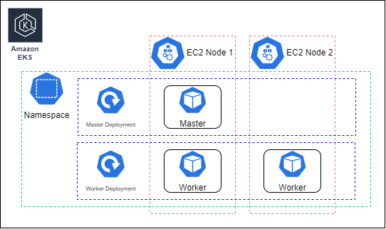

# Configure Minecraft deployment

## Agenda

In this lab we will create and apply deployment for  Minecraft server. This could be reached with kubernetes manifests.

To achieve this we will need to create some Kubernetes resources:

- Namespace
- 2 Deployments: one for master, second for worker
- Service for worker NLB
- Service for master

# Reference Kubernetes Infrastructure Diagram <a name="diagram"></a>


## Create Kubernetes manifests

### Create Namespace:
Create a name space in EKS cluster:
- `name`=`minecraft`

### Create service for Worker(Network Load Balancer)
Create service for worker NLB with the following parameters:
- `name`=`minecraft-service-nlb`
- `namespace`=`minecraft`
- `annotations`:<br>
    &nbsp;&nbsp;`service.beta.kubernetes.io/aws-load-balancer-type: nlb`<br>
    &nbsp;&nbsp;`service.beta.kubernetes.io/aws-load-balancer-nlb-target-type: ip`<br>
    &nbsp;&nbsp;`service.beta.kubernetes.io/aws-load-balancer-scheme: internet-facing`<br>
- `type`=`LoadBalancer`
- `port`=`25565`
- `targetPort`=`25565`

### Create service for Master
- `name`=`minecraft-service`
- `namespace`=`minecraft`
- `port`=`35353`
- `targetPort`=`mc-master-port`
- `protocol`=`TCP`

### Create deployment for Master
- `name`=`minecraft-master`
- `namespace`=`minecraft`
- `image`= path to the Master image in ECR
- `replicas`=`1`
- `port-name`=`mc-master-port`
- `containerPort`=`35353`

### Create deployment for worker
- `name`=`minecraft-worker`
- `namespace`=`minecraft`
- `image`= path to the Worker image in ECR
- `replicas`=`2`
- `affinity` use `podAntiAffinity` with label selector to prevent running workers on the same node.
- `port-name`=`mc-worker-port`
- `containerPort`=`25565`

## Apply Kubernetes manifests
### Deployment via kubectl apply

First Download kubeconfig to access the cluster. You can use aws CLI the following command:
```
aws eks --region ${REGION} update-kubeconfig --name minecraft-eks [--role ${ROLE}]
export KUBECONFIG=~/.kube/config
```
This will add cluster configuration to the default KUBECONFIG path.

Check that you have connection to you EKS cluster with the following command
```
kubectl version
```

Then you should deploy our application with the following command 
```
kubectl -n minecraft apply -f {filename.yaml}
```

Order of the deployment could be as follows: 
1. `namespace` deployment
2. `master` deployment
3. `master` service
4. `worker` deployment
5. `worker` service

### Deployment via CodeDeploy(Optional)

As an advanced task you can automate deployment of Minecraft to your EKS cluster with CodeDeploy(or GitHub Actions).

You are free to automate only CD part- just deploying existing images to a EKS cluster.


Or you can automate the full CI/CD flow starting from the image creation. You can use script from the [task1](./task1_build_image.md) as a base of your pipeline.
Good idea is to parametrise app version and image tags to be able to build images for different Multipaper and Minecraft versions.
In this case you'd create Helm templates instead of simple Kubernetes manifests.

Anyway this task is out from this lab scope and will not be described wider here.

## View all resources
For check all created resources use command:
```
kubectl get all -n minecraft -o wide
```
## Check logs
For check logs use command:
``` 
kubectl logs -f {pod name} -n minecraft
 ```

## Definition of done

All kubernetes resources created, master and worker pods in state "running" with no recurring restarts. There are no significant errors in a pod logs.

## Clean-up

Do not forget to stop and delete your resources on the end of practice. You can use Tags to locate required resources.

