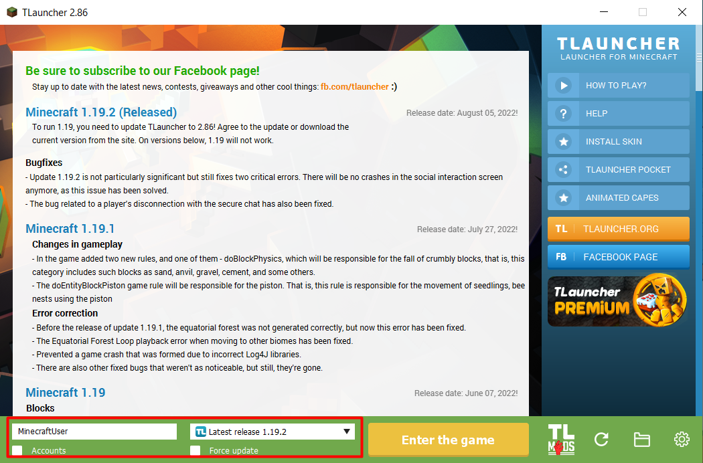
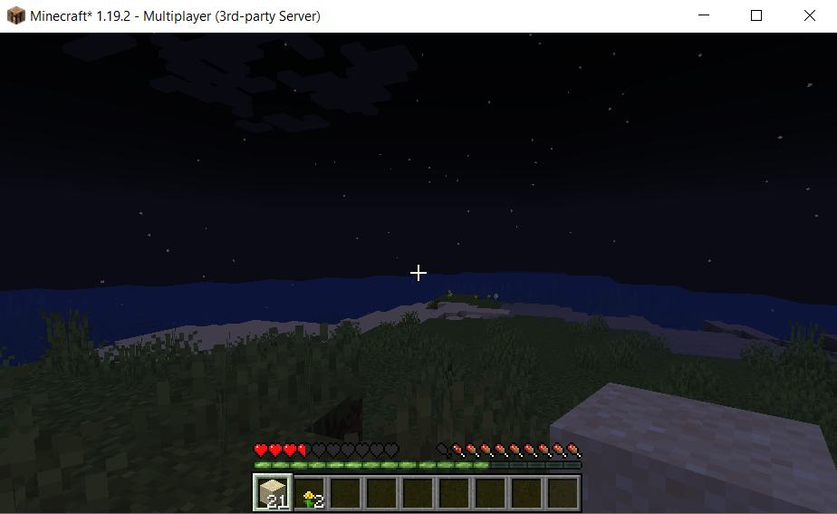

# Testing Minecraft server

## Agenda

In this lab we will perform User Acceptance Testing: we are going to install Minecraft client and play on our server.

## Install and configure minecraft client
- Download minecraft client from https://tlauncher.org/
- Install this client
- Run it
- Enter "User name" + Choose version (1.19.2)
- Click "Enter the game"



## Connect to server
After client start we need to add our server:
- Check NLB endpoint
- Click "Multiplayer" in the minecraft client
- Click "Add Server"
- Enter "Server Name" or leave as exist
- Insert  NLB endpoint to "Server Address"
- Click "Done"

Now you can try to connect to your minecraft server:



## Check pods logs
For see how works NLB between worker pods, you need to do:
- Ensure that KUBECONFIG path are defined

- Check logs on first worker pod:
```
kubectl logs -f {name worker pod1} -n minecraft-ns
```
- Check logs on second worker pod:
```
kubectl logs -f {name worker pod1} -n minecraft-ns
```
- Try to reconnect few times to Minecraft server with Mincraft client

## Definition of done

You can successfully connect to your Minecraft server with Mincraft client. Also you connect to a diffrent worker pods and your progress remains.

## Clean-up

Do not forget to stop and delete your resources on the end of practice. You can use Tags to locate required resources.

